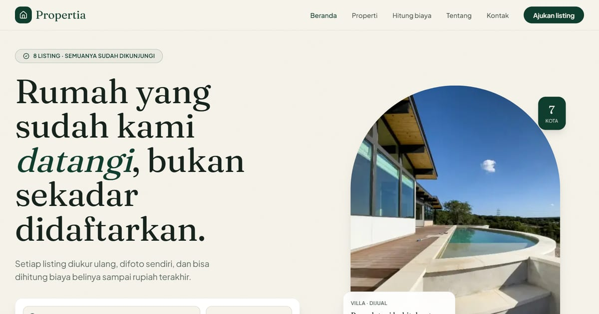

# Propertia — Rumah yang dikurasi

Marketplace butik: sedikit listing, semuanya sudah didatangi dan diukur ulang. Editorial krem–zamrud dengan serif Fraunces dan motif lengkung katedral.

**Demo live:** https://properti-propertia.vercel.app



> Purwarupa desain. Listing, agen, harga, dan alamat adalah contoh fiktif — alamat hanya sampai tingkat kawasan dan tidak ada nomor telepon. Semua formulir (jadwal survei, kontak) hanya menampilkan ringkasan dan tidak mengirim data.

## Fitur khas

- `/biaya` — kalkulator dana tunai beli rumah: uang muka, BPHTB 5% × (harga − NPOPTKP), PPN rumah baru, PPAT & balik nama, biaya KPR, cicilan, dan penghasilan yang disarankan. Bisa dibuka dari halaman detail (`/biaya?id=…`).
- Beranda menampilkan contoh rincian biaya untuk listing unggulan.

## Fitur bersama

- Katalog `/properti` dengan filter status, jenis, kota, harga (beli dan sewa dipisah), kamar, dan urutan.
- Halaman detail: galeri, spesifikasi termasuk harga per m², peta tingkat kecamatan, dan formulir jadwal survei (tanggal dihitung dalam WIB di peramban).
- `/kontak` dengan pilihan topik (tautan "Ajukan listing" membuka topik jual), `/tentang` dengan daftar agen yang disusun dari data.
- Semua konten berasal dari `lib/data.js`; statistik dihitung dari data, bukan klaim.

## Halaman

`/` · `/biaya` · `/kontak` · `/properti` · `/properti/[id]` · `/tentang`

## Teknologi

- Next.js 15.5 (App Router) dan React 19
- Tailwind CSS v4
- JavaScript
- Framer Motion, Lucide (ikon)
- Font: Fraunces, Plus Jakarta Sans (next/font)
- SEO: metadata per halaman, Open Graph, JSON-LD, sitemap.xml, dan robots.txt

## Menjalankan secara lokal

```bash
npm install
npm run dev
```

Buka http://localhost:3000. Untuk build produksi: `npm run build` lalu `npm start`.

## Kredit foto

Semua foto berlisensi CC0 (domain publik), dipotong ke 4:3 dan dikonversi ke WebP.

| Berkas | Fotografer | Sumber | Lisensi |
| --- | --- | --- | --- |
| `apartemen-putih.webp` | — | [rawpixel](https://www.rawpixel.com/image/3285824/free-photo-image-office-building-residence-city) | CC0 |
| `dapur-terang.webp` | The Pic Pac | [StockSnap](https://stocksnap.io/photo/kitchen-sink-L07UXRLREE) | CC0 |
| `kamar-hangat.webp` | — | [rawpixel](https://www.rawpixel.com/image/5917601/image-public-domain-wood-house) | CC0 |
| `kamar-kota.webp` | — | [rawpixel](https://www.rawpixel.com/image/5920688/photo-image-public-domain-house-home) | CC0 |
| `kamar-studio.webp` | Sylwia Pietruszka | [StockSnap](https://stocksnap.io/photo/bed-table-FND1JADL6W) | CC0 |
| `lahan.webp` | JJ Skys the Limit | [StockSnap](https://stocksnap.io/photo/grassy-field-TQZZ18QJPR) | CC0 |
| `ruang-tamu-sofa.webp` | — | [rawpixel](https://www.rawpixel.com/image/5927318/photo-image-public-domain-minimalist-house) | CC0 |
| `ruang-tamu-terang.webp` | — | [rawpixel](https://www.rawpixel.com/image/5917348/image-frame-light-public-domain) | CC0 |
| `ruang-teras-kayu.webp` | Joshua Ness | [StockSnap](https://stocksnap.io/photo/house-home-CLD6T4J9VZ) | CC0 |
| `rumah-dua-lantai.webp` | — | [rawpixel](https://www.rawpixel.com/image/5913733/image-public-domain-plants-house) | CC0 |
| `rumah-kotak.webp` | — | [rawpixel](https://www.rawpixel.com/image/6042800/photo-image-public-domain-minimal-house) | CC0 |
| `rumah-modern.webp` | — | [rawpixel](https://www.rawpixel.com/image/6070500/free-public-domain-cc0-photo) | CC0 |
| `rumah-satu-lantai.webp` | — | [rawpixel](https://www.rawpixel.com/image/5914459/photo-image-public-domain-house-family) | CC0 |
| `teras-kolam.webp` | Matt Bango | [StockSnap](https://stocksnap.io/photo/modern-house-UIU7D31EDY) | CC0 |
| `teras-tropis.webp` | World Travel Adventures | [StockSnap](https://stocksnap.io/photo/furniture-patio-KOIAWLY3SU) | CC0 |
| `villa-batu.webp` | — | [rawpixel](https://www.rawpixel.com/image/6023165/photo-image-public-domain-house-summer) | CC0 |

---

Bagian dari koleksi 4 template marketplace properti di [PortalProperti](https://portal-properti-nu.vercel.app). Dibuat oleh [PintuWeb](https://pintuweb.com), jasa pembuatan website.
